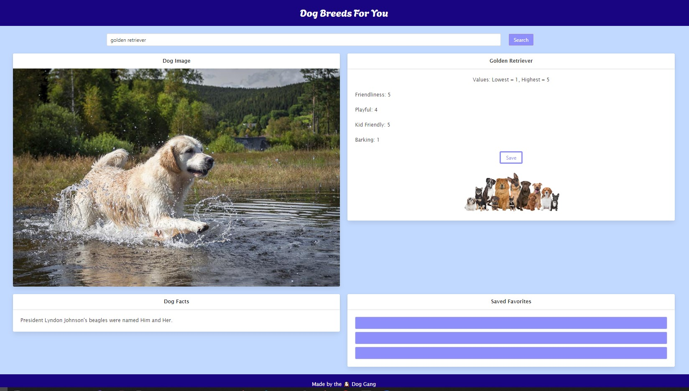
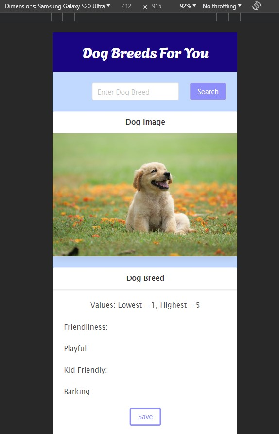

# Dog Breeds for You

## Description

This project aims to help you search for and find your perfect dog companion. Search for any dog of your interest, and make an educated choice based on various statistics of interest. If you can't decide, come back later by saving the dog for future browsing.

Check out our website [here!](https://xtourmaline.github.io/dog-breeds-for-you)

## Table of Contents

- [Usage](#usage)
- [Photos](#photos)
- [Technologies Used](#technologies-used)
- [Collaborators](#collaborators)
- [License](#license)

## Usage

- Visit the website over at [https://xtourmaline.github.io/dog-breeds-for-you](https://xtourmaline.github.io/dog-breeds-for-you).
- Enter a desired dog breed into the search bar and click "Search."
- View an image of your desired breed alongside some common statistics to help you make an educated choice.
- Can't decide? No problem, save your dog in your favorites by pressing "Save", and come back to it anytime.

## Photos

Webpage Desktop View

Modal Message on Improper Input

Mobile Device View (Responsive)

# Technologies Used

- HTML 5
- CSS powered by [Bulma](https://bulma.io/)
- JavaScript powered by [jQuery](https://jquery.com/)
- Dog image and statistics powered by [API Ninjas](https://api-ninjas.com/)
- Random dog facts powered by [Dog API by kinduff](https://dogapi.dog/)

## Collaborators

- [Alphonse Kusluch](https://github.com/Akusluch)
- [Helen Colon](https://github.com/Lychnian)
- [Zion Griffin](https://github.com/griff1nz)

## License

This project is licensed under the MIT License.
